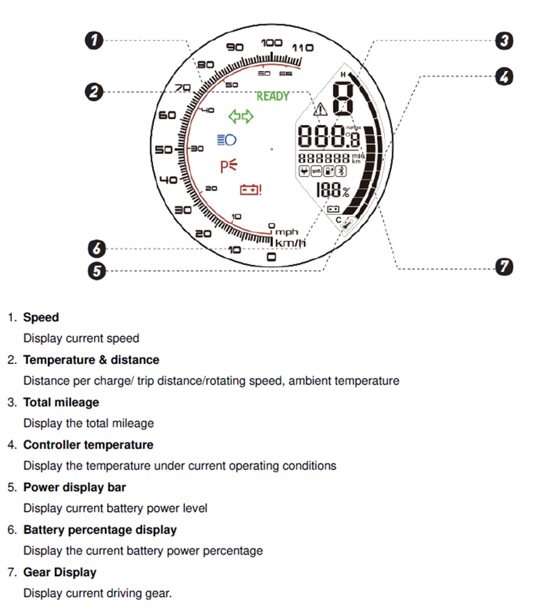

[](https://github.com/stprograms/SuperSoco485Monitor/actions/workflows/build.yml)

# SuperSoco485Monitor
C# Application to monitor the communication on the internal RS485 Bus on SuperSoco Motorcycles

This small application is used for debug and analysis of the data received from the RS485 bus of SuperSoco Motorcycles. It is not compatible with newer motorcycles that use CAN bus as the communication medium. Since this application is a helper for first analysis, the code is more or less written quick and dirty.

Information about the baud rate, Structure of the telegrams and content of the telegrams has been derived from the [Dashboard Android App](https://github.com/Xmanu12/SuSoDevs) of [Xmanu12](https://github.com/Xmanu12).

## Configuration
This section describes how the behavior of the application can be configured.

### appsettings.json
The output of the application is done using the NLog library. That means that the output can be configured using the NLog object in the appsettings.json. It is recommended though that these settings are not changed.

Other than NLog, the application can be configured using the following options in the `Monitor` object in `appsettings.json`.
```json
{
"Monitor": {
    "port": "COM6",
    "writeRawData" : true,
    "outputDir" : "",
    "replayCycle" : 5
}
}
```

| Setting      | Type    | Description                                                                                                                  |
| ------------ | ------- | ---------------------------------------------------------------------------------------------------------------------------- |
| port         | string  | Name of the port to open. eg. COM6                                                                                           |
| writeRawData | boolean | Write all received data also to a binary file. A new file (with timestamp) is created every time the application is started. |
| outputDir    | string  | (optional) If configured, create the binary files in the given folder.                                                       |
| replayCycle  | double  | Cycle for replaying telegrams in milliseconds                                                                                |


### Console arguments
If the application is called without arguments, the application will try to connect to the configured com port and parse the telegrams live. Each telegram is then exported to the console using nlog. The format is either binary or if the telegram is known, written in a decoded way.

If a the path of a binary file is provided as a console argument, the content of the file will be parsed and printed to the console, instead of using the configured serial port.

#### Using the Monitor as simulator
To replay telegrams previously recorded, use a binary file as command argument and provide the flag `-r`. This will open the serial port set in the configuration file and replay the telegrams from the binary file. The timing will not be the same as the original, but the telegrams will be sent in a configurable cycle.

## Necessary hardware
For connecting to the internal RS485 bus of the motorcycle, you need a RS485 to serial converter. You can use all possible versions, like
- RS485 to RS232 com port
- RS485 to USB
- RS485 to bluetooth like mentioned in the [Dashboard Android App](https://github.com/Xmanu12/SuSoDevs) project under documents.

The best way to connect the RS485 is the 4 pin JST SM connector under the seat that connects the internals and the external battery plug. There, the two middle connectors are the RS485 interface.

### JST Connector pinning
SuperSoco (at least TC Max), uses a JST SM 4 pin connector under the seat. This connector can be disconnected if the motorcycle is not charged through the external charger port. Instead of the connection to the external charger, a JST SM 4 pin plug can be connected and attached to a RS485 converter. The pinning of the connector is as following:

| Pin |    Signal    |
| --- | :----------: |
| 1   | brake signal |
| 2   |   RX- / B    |
| 3   |   RX+ / A    |
| 4   |    Ground    |

The brake signal is used to prevent movement when the charger is plugged in.

# RS485 Protocol
The following information is basically taken from the [Dashboard Android App](https://github.com/Xmanu12/SuSoDevs) project and is summarized here. Thank to @linshuweitw who did intensive testing, further insights on the protocol and the packages where gettered.

All the information has been reverse engineered and can therefor hold errors and unknown data.

The communication is using **9600 Baud**, with 8 bit data and 1 stop bit. It is based on requests and responses and data is transmitted in telegrams.

## System and Unit
This system is a two-wire RS485 communication system and includes four different units:
| Unit        | Summary                       | Description                                                                                                                                                                |
| :---------- | :---------------------------- | :------------------------------------------------------------------------------------------------------------------------------------------------------------------------- |
| ECU         | Communication master          | sends requests, receiving responses, consolidating system information.                                                                                                     |
| Speedometer | Displays the vehicle's status | If the ECU is absent from the system, the Speedometer takes over as the master, but it only sends out requests without altering its state based on the responses received. |
| Controller  | Engine control                | Returns Response.                                                                                                                                                          |
| Battery     | Power Supply                  | Returns Response.                                                                                                                                                          |

## Generic information and structure

Each telegram starts with two bytes specifying a request or a response, followed by one byte destination (id) and one byte source (id). After that, the length of the user data in Bytes and the data itself is transmitted. Lastly, a one byte [checksum](#checksum-calculation) and the end tag 0x0D terminates the telegram.

| Byte |   0   |   1   |   2   |   3    |    4    |  4 + 1  |  4 + 2  |  ...  |   4 + n   | 4 + n + 1 | 4 + n + 2 |
| :--- | :---: | :---: | :---: | :----: | :-----: | :-----: | :-----: | :---: | :-------: | :-------: | :-------: |
|      | type1 | type2 | dest  | source | len (n) | data[0] | data[1] |  ...  | data[n-1] | checksum  |   0x0D    |

### Telegram types
There are two known combinations for the type:
| Byte0 | Byte1 | Type     | Description                                                |
| ----: | :---- | -------- | ---------------------------------------------------------- |
|  0xC5 | 0x5C  | Request  | Telegram **actively** send by the master to a unit         |
|  0xB6 | 0x6B  | Response | Telegram send in response to a previously received request |

### Unit addresses
The following addresses of the units could be identified. The addresses are used either as source or as destination in the telegram fields

| Addr | Type        |
| :--- | :---------- |
| 0xAA | Master      |
| 0xBA | Speedometer |
| 0xDA | Controller  |
| 0x5A | Battery     |

### Telegrams
The communication inside the bike consists of the following identified telegrams:

| Package Type                               | Destination | Source      | Bytes | Pdu Length |
| :----------------------------------------- | :---------- | :---------- | :---: | ---------: |
| [Speedometer_Req](#speedometer---request)  | Speedometer | Master      | BA AA |         14 |
| [Speedometer_Res](#speedometer---response) | Master      | Speedometer | AA BA |          1 |
| [Controller_Req](#controller---request)    | Controller  | Master      | DA AA |          2 |
| [Controller_Res](#controller---response)   | Master      | Controller  | AA DA |         10 |
| [Battery_Req](#battery---request)          | Battery     | Master      | 5A AA |          1 |
| [Battery_Res](#battery---response)         | Master      | Battery     | AA 5A |         10 |

## Checksum calculation
The checksum byte is calculated by making an XOR calculation of the data Bytes and the length Byte. The following C# example shall deepen the understanding how the checksum is calculated.

```c#
// dataLen holds the value of the length byte
// rawData is a byte[] holding the raw data between the length byte and the checksum byte

byte calcCheck = dataLen;
foreach (byte b in rawData)
{
    calcCheck ^= b;
}

if (calcCheck == checksum)
{
    // Data is valid
}

```

# Decoded telegrams
The following chapter holds the list of telegrams that are (partly) decoded. Like described in the beginning, there is no guarantee for correctness and completeness.

## Speedometer


### Speedometer - Request
This is a request actively send from the master to the speedometer. It holds information to be displayed on the speedometer itself.

| Byte (len=14) |   0   |           1            |      2       |        3        |   4   |   5   |    6     |    7     |       8       |      9      |        10         |        11         |  12   |       13        |
| ------------- | :---: | :--------------------: | :----------: | :-------------: | :---: | :---: | :------: | :------: | :-----------: | :---------: | :---------------: | :---------------: | :---: | :-------------: |
|               |  Soc  | Controller<br/>Current | SpeedDisplay | Controller Temp |   ?   |   ?   | Errcode0 | Errcode1 | Vehicle State | GearDisplay | Speed From Ctrl H | Speed From Ctrl L |   ?   | Remaining Range |

#### Field description
| Variable        | Description                            | Unit | Range                    |                                                                                                      |
| --------------- | -------------------------------------- | ---- | ------------------------ | ---------------------------------------------------------------------------------------------------- |
| Soc             | Battery percentage display             | %    | 0 - 100                  | Soc > 100 wil not display. value = last Soc received from Battery.                                   |
| CtrlCurrent     | Current taken by the engine controller | 2.5A | 0x00 - 0x19 (0 ~ 30A)    | [Additional info](#ctlrcurrent)                                                                      |
| SpeedDisplay    | Speed to display                       | km/h | 0 - 127(estimated value) | [Additional info](#speeddisplay)                                                                     |
| CtrlTempDisplay | Temperature level of Controller        | -    | 0 - 9                    | [Additional info](#ctrltempdisplay)                                                                  |
| Errcode         | Error code to display                  | -    | -                        | See the [Error Code Table](#error-codes) for details                                                 |
| Vehicle State   | State of the vehicle                   | -    | -                        | Charging = 4, Parking = 1, else = 0, *Something* = 10 . *Something* related to Ctrl[Unknown state] . |
| GearDisplay     | Selected gear                          | -    | 0 - 3                    | Values > 3 will not be displayed                                                                     |
| Speed From Ctrl | Raw speed value from controller        | -    | -                        | [Additional info](#speeddisplay)                                                                     |
| Remaining Range | Calculated remaining range             | km   | 0-255                    | [Additional info](#remaining-range)                                                                  |

##### CtlrCurrent
Related to the last current value submitted by the [engine controller](#controller---response). The highest value that will be submitted here equals 30A.

```c#
// CtrlCurrent: Value sent to speedometer
// Ctrl[Current]: last received value for current from engine controller

if (Ctrl[Current] > 30)
{
    CtrlCurrent = 30;
}
else
{
    CtrlCurrent = Ctrl[Current];
}
```

##### SpeedDisplay
Current vehicle speed in km/h. The odometer in the Speedometer will treat values greater than 127 as 127. The base value is taken from the [engine controller](#controller---response) and is calculated as follows:

```c#
// SpeedDisplay: Value sent to the speedometer
// Ctrl[speed]: last received speed value received from engine controller

SpeedDisplay = Ctrl[speed] * 0.11;
```

##### CtrlTempDisplay
Temperature level of the controller displayed on the speedometer (5). This value is calculated based on the last temperature value received from the [engine controller](#controller---response). Values greater than 10 will not be displayed by the Speedometer.

```c#
// CtrlTempDisplay: Value send to the speedometer
// Ctrl[temp]: Temperature value received from controller
CtlTempDisplay = Ctrl[temp] / 20;
```

##### Remaining Range
The remaining range is being calculated based on the remaining SoC received from the Battery and the selected gear.

```c#
/* gear: currently selected gear (1-3) or 0 if battery is disconnected
 * soc: state of charge received from battery
 * range: transmitted remaining range in km
 */
float f (int gear)
{
    return 1 - ( (gear - 1) * 0.2);
}

range = (byte) (soc * f(gear));
```

### Speedometer - Response
The response of the speedometer only holds 1 Byte of data. The interpretation of this Byte is currently unknown. The response can probably be seen as an acknowledgement that the request has been received.

| Byte (len=1) |   0   |
| ------------ | :---: |
|              |   ?   |

## Controller
Engine controller

### Controller - Request
This request is sent from the master to the controller. It informs the controller with the current charging state. This will also trigger the controller to send a [response](#controller---response).

| Byte (len=2) |   0   |       1        |
| ------------ | :---: | :------------: |
|              |   ?   | Charging State |

#### Field description
| Variable       | Description                                                      | Unit    | Range |
| -------------- | ---------------------------------------------------------------- | ------- | ----- |
| Charging State | Informs the controller if the motorcycle is been charged or not. | Boolean | 0 / 1 |

If the last provided charging state is 1, the controller will prevent the motor from starting. If the last transmitted state was 0, the motor is allowed to start. The charging information is provided by the [Battery](#battery---response) and will be forwarded to the controller.

### Controller - Response

| Byte (len=10) |   0   |     1      |     2      |    3     |    4     |      5      |     6     |       7       |    8    |   9   |
| ------------- | :---: | :--------: | :--------: | :------: | :------: | :---------: | :-------: | :-----------: | :-----: | :---: |
|               | Gear  | Current(H) | Current(L) | Speed(H) | Speed(L) | Temperature | ErrorCode | Unknown State | Parking |   ?   |

#### Field description
| Variable      | Description                                          |    Unit    | Range            |
| ------------- | ---------------------------------------------------- | :--------: | ---------------- |
| Gear          | current gear, selected by switch on level            |     -      | 1 - 3            |
| Current       | current drawn by the motor                           |    0.1A    |                  |
| Speed         | current speed                                        | 0.028 km/h |                  |
| Temperature   | Controller temperature                               |     °C     |                  |
| ErrorCode     | See the [error code table](#error-codes) for details |     -      |                  |
| Unknown State | Something? = 2, will change Vehicle State to 0x10    |     -      |                  |
| Parking       | parking mode (depends on the side stand)             |     -      | on = 2 / off = 1 |


#### Parking
This seems to depend on the software version of the controller. Some people reported that the interpretation of parking is inverted:

| Value | Mode          |
| :---: | ------------- |
|   1   | park mode on  |
|   2   | park mode off |

## Battery
These telegrams are send to / received from the battery management system of the battery.

### Battery - Request
This request is sent from the master to the BMS to request the current battery state. It holds no (known) data.

| Byte (len=1) |   0   |
| ------------ | :---: |
|              |   ?   |

### Battery - Response

The response returned by the BMS upon a request telegram.

| Byte (len=10) |   0   |   1   |   2   |    3    |    4     |    5     |      6      |      7      |     8      |    9     |
| ------------- | :---: | :---: | :---: | :-----: | :------: | :------: | :---------: | :---------: | :--------: | :------: |
|               | Volt  |  Soc  | Temp  | Current | Cycle(H) | Cycle(L) | Discycle(H) | Discycle(L) | Error Code | Charging |

#### Field description
| Variable  | Unit | Description                                                      |
| --------- | ---- | ---------------------------------------------------------------- |
| Volt      | V    | Voltage value of the battery                                     |
| Soc       | %    | State of charge in percent                                       |
| Temp      | °C   | Temperature of the battery                                       |
| Current   | A    | Charge or discharge current. [Additional info](#current)         |
| Cycle     | -    | Number of loading cycles                                         |
| Discycle  | -    | Number of discharging cycles                                     |
| ErrorCode | -    | See the [error code table](#error-codes) for details             |
| Charging  | -    | Charging = 1 , (Discharging = 4?, not observed. Cause BMS diff?) |

#### Current
Current fed into or taken from the battery. Values < 0 describe discharge of the battery.

## Error Codes

| Byte | Bit | ErrorCode | Report Unit | Report Bit                | Other                                                                                    |
| ---- | --- | --------- | ----------- | ------------------------- | ---------------------------------------------------------------------------------------- |
| 6    | 0   | 99        | Ctrl        | Disconnect                |                                                                                          |
| 6    | 1   | 98        | Ctrl        | Ctrl (6,1 \| 2 \| 4 \| 5) | over current?</br> motor blocking= bit5</br> under voltage = bit4</br> over temperature? |
| 6    | 2   | 97        | Ctrl        | Ctrl (6,0)                |                                                                                          |
| 6    | 3   | 96        | Ctrl        | Ctrl (6,0)                |                                                                                          |
| 6    | 4   | 95        | Ctrl        | Ctrl (6,6)                |                                                                                          |
| 6    | 5   | 94        | Battery     | Disconnect                |                                                                                          |
| 6    | 6   | 93        | Battery     | Battery (8,1)             |                                                                                          |
| 6    | 7   | 92        | Battery     | Battery (8,0)             |                                                                                          |
| 7    | 0   | 91        | Battery     | Battery[Temp] >= 3B(60°C) |                                                                                          |
| 7    | 1   | 90        | Battery     | Battery (8,2)             |                                                                                          |
| 7    | 2   | 89        | Battery     | Battery (8,5)             |                                                                                          |
| 7    | 3   | 88        | Battery     | Battery (8,7)             |                                                                                          |
| 7    | 4   | 87        | X           |                           |                                                                                          |
| 7    | 5   | 86        | X           |                           |                                                                                          |

Ctrl(1,2) means the bit is at Ctrl pdu byte 1, bit 2


## Testing Method
The described methods here where from @linshuweitw, who intensively tested the communication on the bike. Testing included but was not limited to the following approaches:

### Unplugging and re-plugging physical wiring:
Dynamically unplug and re-plug the RS485 physical wiring to test the system's response during communication interruptions and recovery.

### Removing components and simulating communication packets:
Remove a component and use a simulation tool to generate communication packets for the removed component. Test how the other components react to the simulated packets.

### Operating the vehicle and monitoring packets:
Operate the vehicle (e.g., accelerate, decelerate) and monitor the RS485 communication data to verify that the packets correspond to changes in the vehicle's status.

### Triggering vehicle status via external input:
Use external devices (such as controlling the power supply to replace the battery) to simulate specific vehicle conditions, such as triggering undervoltage, and monitor the system’s response.

## Additional notes
As @pervolianinen stated in https://github.com/stprograms/SuperSoco485Monitor/issues/2#issuecomment-1676308814, this is a generic protocol that is used in all Lingbo controllers. Using specific hardware converters, the monitor application can be use on these interfaces too. For CAN, this would also need enhancement in how the data is extracted.

# Further projects
This chapter shall contain a list of projects that build upon this project or also target the communication of SuperSoco.

|                          Project                           | Description                                                     |
| :--------------------------------------------------------: | --------------------------------------------------------------- |
| [SuperSoco485](https://github.com/stprograms/SuperSoco485) | Arduino library that implements the specification defined here. |
